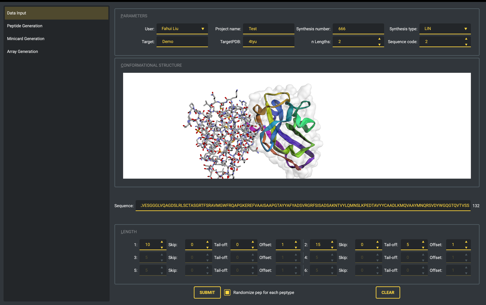
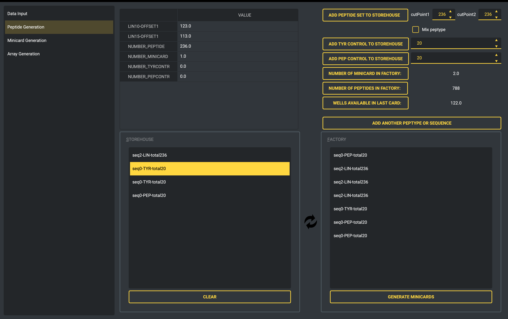
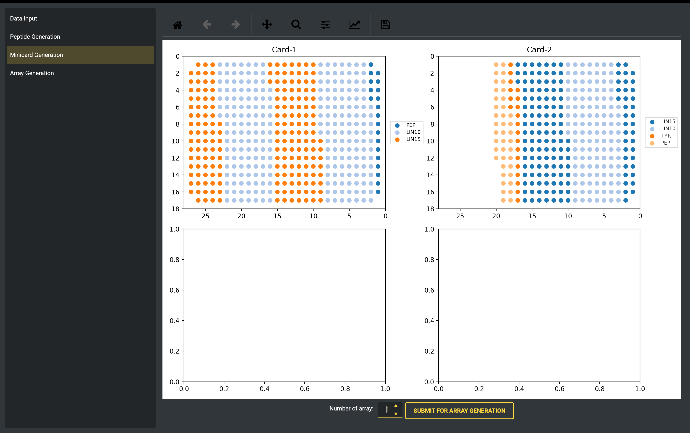
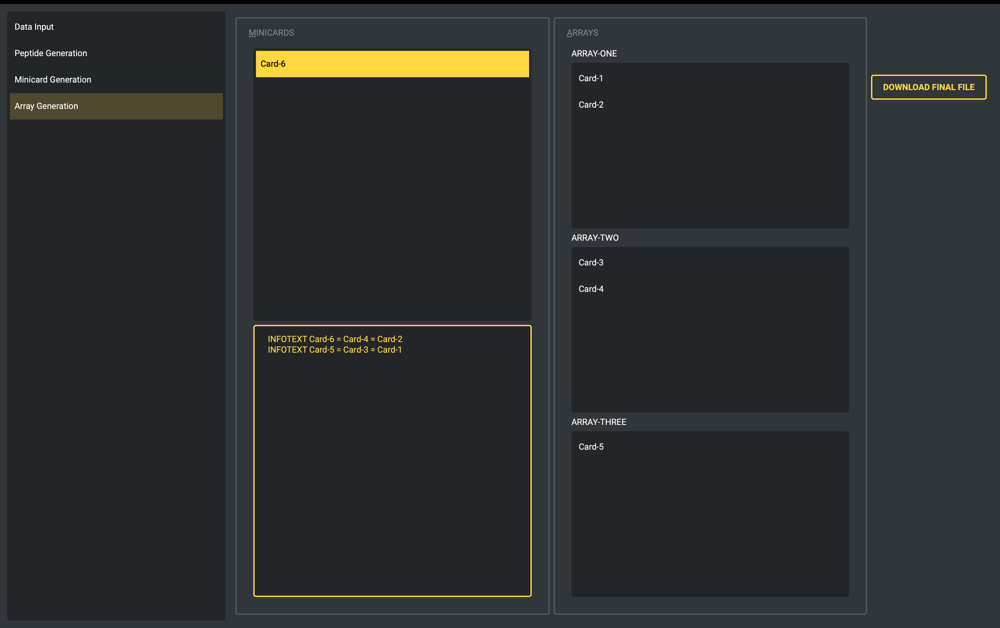

# Peptide generator

The software application is designed to generate pepdids of specific lengths and offsets, and provides the ability to clip the origin sequence to a targeted region. The resultant peptides are then assigned to a microarray, alongside control peptides, which can be visualized to provide a comprehensive overview. Further, the microarray can be utilized to generate a minicard array, thereby facilitating efficient and high-throughput peptide analysis.

Project settings

Generate peptides

Generate minicards

Generate card arrays (duplicates)

